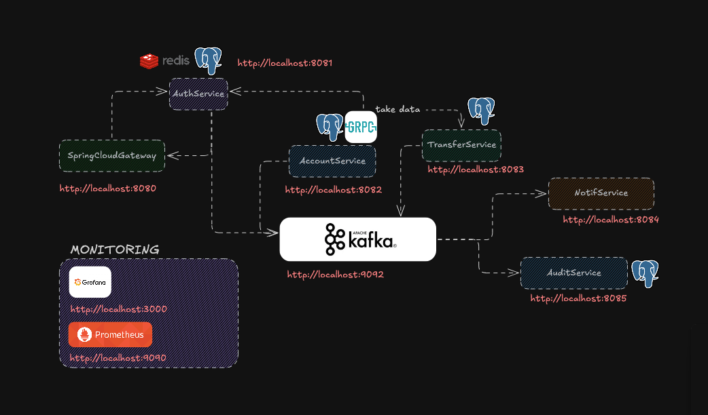

# 🏦 Banking Microservices 

A reactive banking platform built on a microservices architecture. Each service is independently deployable, communicates asynchronously via Kafka, and is observable through a shared monitoring stack.



---

## Services

| Service | Port | Responsibility |
|---|---|---|
| 🌐 **gateway-service** | `8080` | Single entry point. Routes and authenticates all inbound traffic via Spring Cloud Gateway. |
| 🔐 **auth-service** | `8081` | Identity & access management. Handles registration, login, MFA (TOTP), JWT issuance, rate limiting. |
| 💳 **account-service** | `8082` | Bank account lifecycle. Create, query, and manage customer accounts. Communicates with transfer-service via gRPC. |
| 💸 **transfer-service** | `8083` | Fund transfer processing. Validates and executes transfers, pulls account data from account-service via gRPC. |
| 🔔 **notif-service** | `8084` | Notification delivery. Consumes Kafka events and dispatches email/push/SMS to customers. |
| 📋 **audit-service** | `8085` | Compliance audit trail. Persists all domain events from Kafka into an append-only audit log. |

---

## Shared Infrastructure (`docker-compose.shared.yaml`)

Spun up once and shared across all services via `shared-network`.

| Component | Port | Role |
|---|---|---|
| 📨 **Kafka** (KRaft) | `9092` | Event bus — async inter-service communication |
| 🖥️ **Kafka UI** | `8090` | Web UI for inspecting topics, consumers, and messages |
| 🔥 **Prometheus** | `9090` | Scrapes `/actuator/prometheus` from each service |
| 📊 **Grafana** | `3000` | Dashboards built on top of Prometheus metrics |
| 🔭 **Jaeger** | `16686` | Distributed tracing — end-to-end request visibility across services |

> **Note:** PostgreSQL and Redis are **not** shared — each service provisions its own database via its own `docker-compose.yaml` to maintain data isolation.

---

## 🚀 Startup Order

Shared infrastructure **must** be running before any service is started. Within services, the gateway should always start last.

```
docker-compose.shared.yaml  →  auth/account/transfer/notif/audit  →  gateway
```

And each service directory contains its own `docker-compose.yaml`, `.env.example`, and `README.md`.

> ⚠️ Copy `.env.example` → `.env` and fill in credentials before starting any service.

### 1. Start shared infrastructure


```bash
docker compose -f docker-compose.shared.yaml up -d
```

### 2. Start all services

```bash
docker compose -f auth-service/docker-compose.yaml up -d
docker compose -f account-service/docker-compose.yaml up -d
docker compose -f transfer-service/docker-compose.yaml up -d
docker compose -f notif-service/docker-compose.yaml up -d
docker compose -f audit-service/docker-compose.yaml up -d
docker compose -f gateway-service/docker-compose.yaml up -d  # last
```

### One-liner

```bash
docker compose -f docker-compose.shared.yaml up -d && \
docker compose -f auth-service/docker-compose.yaml up -d && \
docker compose -f account-service/docker-compose.yaml up -d && \
docker compose -f transfer-service/docker-compose.yaml up -d && \
docker compose -f notif-service/docker-compose.yaml up -d && \
docker compose -f audit-service/docker-compose.yaml up -d && \
docker compose -f gateway-service/docker-compose.yaml up -d
```

### 🛑 Teardown

```bash
docker compose -f gateway-service/docker-compose.yaml down && \
docker compose -f auth-service/docker-compose.yaml down && \
docker compose -f account-service/docker-compose.yaml down && \
docker compose -f transfer-service/docker-compose.yaml down && \
docker compose -f notif-service/docker-compose.yaml down && \
docker compose -f audit-service/docker-compose.yaml down && \
docker compose -f docker-compose.shared.yaml down
```

---

## 📊 Observability

| Tool | URL | Credentials |
|---|---|---|
| Grafana | `http://localhost:3000` | `admin / admin123` |
| Prometheus | `http://localhost:9090` | — |
| Jaeger | `http://localhost:16686` | — |
| Kafka UI | `http://localhost:8090` | — |

---


