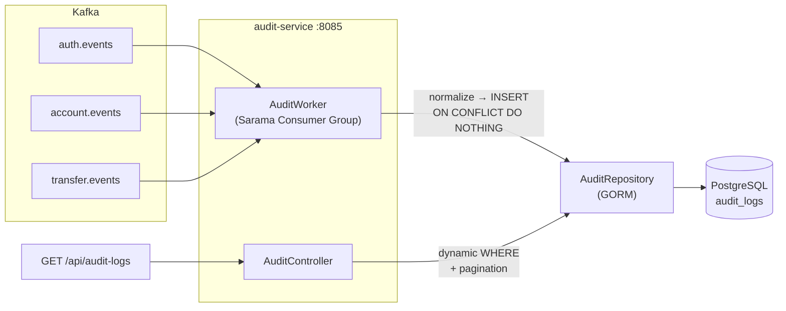

# 🏦 Audit Service

An **append-only audit trail** microservice for the Banking Services ecosystem.  
Consumes domain events from Kafka, normalizes them into a unified audit log, and persists them to PostgreSQL. Exposes a single read-only REST API for querying the audit trail with flexible filters.

---

## Architecture



---

## Getting Started

> ⚠️ **Important:** The root-level shared compose (containing Kafka, Zookeeper, and other shared infrastructure) must be **up and running first** before starting this service, as it creates the `shared-network` that this service depends on.

### 1. Start Shared Infrastructure

```bash
# Navigate to the root banking-services directory
cd /path/to/banking-services

# Start shared services (Kafka, Zookeeper, etc.)
docker compose up -d
```

### 2. Start Audit Service

```bash
cd audit-service
docker compose up -d --build
```

This will:
1. Build the Go application
2. Start PostgreSQL (`audit-postgres`) on port `5555`
3. Run database migrations via `golang-migrate`
4. Start the audit service on port `8085`

### 3. Verify

```bash
# Health check
curl http://localhost:8085/health

# Check logs
docker logs -f audit-service
```

---

## API Reference

### Health Check

```
GET /health
```

No authentication required. Returns `200 OK` if the service is running.

---

### Query Audit Logs

```
GET /api/audit-logs
Authorization: Bearer <JWT_TOKEN>
X-Correlation-ID: <optional-uuid>
```

**Authentication:** Requires a valid JWT token (RS256, issued by auth-service).

#### Query Parameters

| Parameter | Type | Required | Default | Description |
|-----------|------|----------|---------|-------------|
| `user_code` | string | ❌ | — | Filter by user code (e.g. `USR-20260417-00001`) |
| `event_type` | string | ❌ | — | Filter by event type (e.g. `user.login.failed`) |
| `event_source` | string | ❌ | — | Filter by source: `AUTH`, `ACCOUNT`, `TRANSFER` |
| `resource_type` | string | ❌ | — | Filter by resource: `USER`, `ACCOUNT`, `TRANSFER` |
| `resource_id` | string | ❌ | — | Filter by resource ID (e.g. account number) |
| `start_date` | string | ❌ | — | Filter `occurred_at >=` date (format: `YYYY-MM-DD`) |
| `end_date` | string | ❌ | — | Filter `occurred_at <=` date (format: `YYYY-MM-DD`) |
| `page` | int | ❌ | `1` | Page number |
| `size` | int | ❌ | `20` | Page size (max: `100`) |

#### Example Requests

**Get all audit logs (default pagination):**
```bash
curl -H "Authorization: Bearer <TOKEN>" \
     "http://localhost:8085/api/audit-logs?page=1&size=20"
```

**Get all auth events for a specific user:**
```bash
curl -H "Authorization: Bearer <TOKEN>" \
     "http://localhost:8085/api/audit-logs?user_code=USR-20260417-00001&event_source=AUTH"
```

**Get failed login attempts within a date range:**
```bash
curl -H "Authorization: Bearer <TOKEN>" \
     "http://localhost:8085/api/audit-logs?event_type=user.login.failed&start_date=2026-04-01&end_date=2026-04-18"
```

**Get all transfer events today:**
```bash
curl -H "Authorization: Bearer <TOKEN>" \
     "http://localhost:8085/api/audit-logs?event_source=TRANSFER&start_date=2026-04-18&end_date=2026-04-18"
```

**Get all events for a specific account:**
```bash
curl -H "Authorization: Bearer <TOKEN>" \
     "http://localhost:8085/api/audit-logs?resource_type=ACCOUNT&resource_id=1234567890"
```

#### Success Response

```json
{
  "header": {
    "isSuccess": true,
    "correlationId": "audit-test-001"
  },
  "data": {
    "content": [
      {
        "id": 1,
        "event_id": "evt-abc-123",
        "event_type": "user.login.success",
        "event_source": "AUTH",
        "user_code": "USR-20260417-00001",
        "resource_type": "USER",
        "resource_id": "USR-20260417-00001",
        "ip_address": "192.168.1.100",
        "user_agent": "Mozilla/5.0",
        "payload": { "...raw event JSON..." },
        "occurred_at": "2026-04-17T10:30:00Z",
        "received_at": "2026-04-17T10:30:01Z"
      }
    ],
    "page": 1,
    "size": 20,
    "total_elements": 150,
    "total_pages": 8
  }
}
```

#### Error Responses

| Status | Description |
|--------|-------------|
| `400 Bad Request` | Invalid query parameter (e.g. wrong date format, invalid event_source) |
| `401 Unauthorized` | Missing or invalid JWT token |
| `500 Internal Server Error` | Database or internal error |

---

## Event Sources

The audit service consumes events from three Kafka topics:

| Topic | Source | Event Types |
|-------|--------|-------------|
| `auth.events` | AUTH | `user.registered`, `user.login.success`, `user.login.failed`, `user.password.changed`, `user.password.reset`, `user.mfa.enabled`, `user.mfa.validated`, `user.account.locked`, `user.logout` |
| `account.events` | ACCOUNT | `account.opened`, `account.frozen`, `account.closed`, `account.unfrozen`, `account.deposit.matured`, `account.rdn.verified` |
| `transfer.events` | TRANSFER | `transfer.confirmed` |
