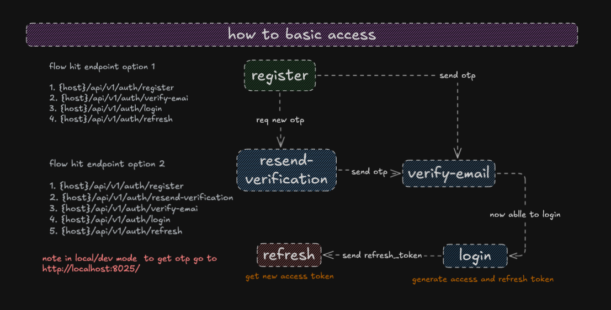
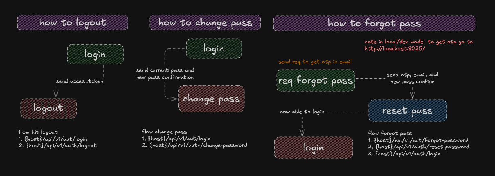
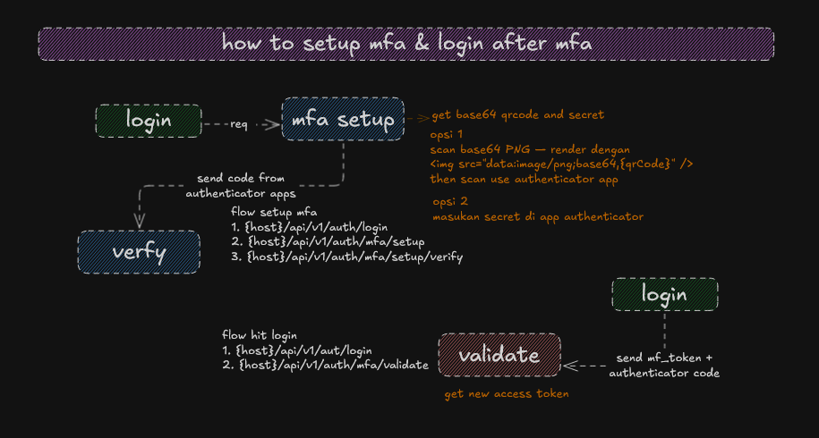

# Auth Service — Banking Authentication Microservice

Production-grade authentication microservice for a banking platform built with  **Spring Boot 4.0.3 + WebFlux (reactive)**.
Handles the full authentication lifecycle registration, email verification,
MFA (TOTP), JWT session management, and password recovery  with Redis-backed
rate limiting and Kafka event publishing for audit trail.

---

## Features

| | |
|---|---|
| 📧 | Email OTP verification on registration |
| 🔐 | Multi-Factor Authentication (TOTP / Google Authenticator) |
| 🎫 | JWT authentication — access token + refresh token |
| 🔑 | Password management (change, forgot, reset) |
| 🛡️ | Redis sliding-window rate limiting per IP per endpoint |
| 📨 | Kafka event publishing for audit trail |
| 🔒 | Account lockout after 5 consecutive failed login attempts |

---

## Tech Stack

| Layer | Technology |
|---|---|
| Runtime | Java 25, Spring Boot 4.0.3 |
| Web | Spring WebFlux (reactive, non-blocking) |
| Database | PostgreSQL · R2DBC · Flyway |
| Cache / Rate Limiting | Redis (Lettuce reactive client) |
| Messaging | Apache Kafka (KRaft mode) |
| Security | Spring Security · JWT (JJWT 0.12.x) · TOTP |
| Mail | JavaMail · Mailhog (dev) |
| Docs | SpringDoc OpenAPI 3.x (Swagger UI) |
| Monitoring | Actuator · Prometheus · Grafana |

---

## Authentication Flows

Detailed flow diagrams are provided under `doc/` as a reference for frontend integration.

### Flow 1 — Basic Access

Registration through to token refresh.



---

### Flow 2 — Session Management

Logout, change password, and forgot/reset password.



---

### Flow 3 — MFA Setup & Login

One-time TOTP setup and MFA-gated login.



---

## Running the Application

### Docker (Recommended)

> ⚠️ Start the shared infrastructure first — Kafka, Prometheus, Grafana, and Jaeger are defined in a separate compose file outside this directory.

```bash
# 1. Start shared infrastructure
docker compose -f ../docker-compose.shared.yml up -d

# 2. Configure environment
cp .env.example .env
# Edit .env — fill in DB_PASSWORD, REDIS_PASSWORD, JWT_PRIVATE_KEY, JWT_PUBLIC_KEY

# 3. Start auth-service
docker compose up -d
```

> This service joins both `auth-network` (internal) and `shared-network` (to reach Kafka).

---

### Local (Without Docker)

> ⚠️ Ensure the following services are installed and running locally before starting.

| Service | Default Port |
|---|---|
| PostgreSQL | `5432` |
| Redis | `6379` |
| Kafka | `9092` |
| Mailhog SMTP | `1025` |
| Mailhog Web UI | `8025` |

```bash
# 1. Copy environment file
cp .env.example .env
```

```yaml
# 2. Update src/main/resources/application.yaml to point at localhost
spring:
  r2dbc:
    url: r2dbc:postgresql://localhost:5432/auth_db
  data:
    redis:
      host: localhost
  kafka:
    bootstrap-servers: localhost:9092
  mail:
    host: localhost
```

```bash
# 3. Run
./mvnw spring-boot:run        # Linux / macOS
.\mvnw spring-boot:run        # Windows
```

Service starts at `http://localhost:8081`.

---

## Running Tests

```bash
./mvnw test           # Linux / macOS
.\mvnw test           # Windows
```