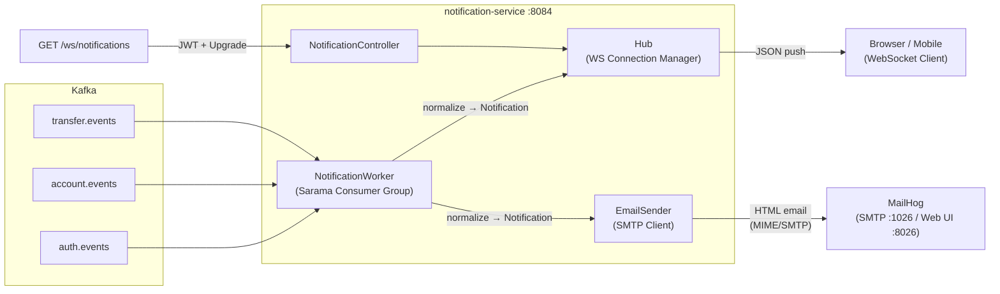

# Notification Service

A real-time, event-driven notification service for the **Banking Services** platform. It consumes domain events from Kafka topics and dispatches notifications through two channels:

- **WebSocket (WS)** — real-time in-app alerts pushed to the connected client.
- **Email (SMTP)** — templated HTML emails sent via SMTP (MailHog in development, production SMTP in production).

The service runs on port **`:8084`** and has no database — all routing and user resolution is handled in-memory with concurrent-safe caches.

---

## Architecture



### Component Overview

| Component | Package | Responsibility |
|---|---|---|
| **NotificationWorker** | `internal/worker` | Sarama consumer group that subscribes to `auth.events`, `account.events`, and `transfer.events`. Deserializes payloads, maps them to `Notification` objects via event mappers, and dispatches to the appropriate channel (WS / Email). |
| **Hub** | `internal/hub` | Thread-safe WebSocket connection manager. Maps `userCode → set of *websocket.Conn`. Supports multi-device (multiple connections per user). Broken connections are cleaned up on write failure. |
| **NotificationController** | `internal/delivery/http` | Fiber HTTP handler that upgrades `GET /ws/notifications` to WebSocket. Extracts `userCode` from JWT claims and registers the connection to the Hub. |
| **EmailSender** | `internal/notification` | Sends templated HTML emails via raw SMTP dial. Uses `net.Dial` (non-TLS) for MailHog compatibility and a custom `plainAuthUnsafe` for internal SMTP servers that accept PLAIN auth without STARTTLS. |
| **Event Mappers** | `internal/event` | Pure functions (`MapAuthEvent`, `MapAccountEvent`, `MapTransferEvent`, `MapFlatTransferEvent`) that convert raw Kafka payloads into `[]Notification` with channel routing decided per event type. |
| **JWT Middleware** | `internal/delivery/http/middleware` | Validates RS256 JWT tokens. Accepts the token via `Authorization: Bearer <token>` header or `?token=<token>` query parameter (for WebSocket). Injects `userId`, `userCode`, and `role` into Fiber context. |

---

## Event Routing Matrix

Each Kafka event type is routed to specific notification channels based on banking best practices:

### Auth Events (`auth.events`)

| Event Type | WebSocket | Email | Rationale |
|---|:---:|:---:|---|
| `user.registered` | ✅ | ✅ | Welcome email + real-time onboarding |
| `user.login.success` | ✅ | ❌ | Too frequent for email; WS activity feed |
| `user.login.failed` | ✅ | ✅ | Security alert |
| `user.password.changed` | ✅ | ✅ | Sensitive change confirmation |
| `user.password.reset` | ✅ | ✅ | Reset confirmation |
| `user.mfa.enabled` | ✅ | ✅ | Security upgrade confirmation |
| `user.mfa.validated` | ✅ | ❌ | Transient, no email needed |
| `user.account.locked` | ✅ | ✅ | Critical security alert |
| `user.logout` | ❌ | ❌ | No notification needed |

### Account Events (`account.events`)

| Event Type | WebSocket | Email | Rationale |
|---|:---:|:---:|---|
| `account.opened` | ✅ | ✅ | New account confirmation |
| `account.frozen` | ✅ | ✅ | Critical alert |
| `account.closed` | ✅ | ✅ | Account closure confirmation |
| `account.unfrozen` | ✅ | ✅ | Reactivation confirmation |
| `account.deposit.matured` | ✅ | ✅ | Important financial event |
| `account.rdn.verified` | ✅ | ✅ | RDN verification confirmation |

### Transfer Events (`transfer.events`)

| Event Type | WebSocket | Email | Rationale |
|---|:---:|:---:|---|
| `TRANSFER_CONFIRMED` | ✅ | ✅ | Transfer receipt (official proof) |
| `TOP_UP_SUCCESS` | ✅ | ✅ | Top-up receipt |

---

## Getting Started

### Prerequisites

- Go 1.25+
- Docker & Docker Compose
- Running Kafka broker (default: `localhost:9092`)
- RSA public key for JWT verification at `secrets/public.pem`

### Run Locally

```bash
# Start MailHog (SMTP testing)
docker-compose up -d notification-mailhog

# Run the service
go run cmd/web/main.go
```

### Run with Docker

```bash
docker-compose up -d --build
```

---

## WebSocket Connection Guide

The notification service exposes a WebSocket endpoint for real-time event delivery:

```
ws://localhost:8084/ws/notifications?token=<JWT_TOKEN>
```

### Authentication

The WebSocket endpoint is protected by JWT (RS256). You can provide the token in two ways:

| Method | Format |
|---|---|
| **Query Parameter** (recommended for WS) | `ws://localhost:8084/ws/notifications?token=eyJhbGciOi...` |
| **Authorization Header** | `Authorization: Bearer eyJhbGciOi...` |

> **Note:** Most WebSocket clients (browsers) do not support custom headers during the handshake, so the query parameter method is the standard approach.

### Connection Lifecycle

```
Client                           Server
  │                                 │
  ├── GET /ws/notifications?token=  │
  │   (HTTP Upgrade Request)        │
  │                                 │
  │   ◄── 101 Switching Protocols ──┤  JWT validated, connection upgraded
  │                                 │
  │   ◄── {"type":"CONNECTED",...} ─┤  Initial ACK message
  │                                 │
  │   ◄── {"user_code":"...",...} ──┤  Push notifications as Kafka events arrive
  │   ◄── {"user_code":"...",...} ──┤
  │        ...                      │
  │                                 │
  ├── close ────────────────────────┤  Client disconnects
  │                                 │
```

### Quick Test with the Built-in Test Client

The project includes a ready-to-use HTML test client:

1. Open `test-client.html` in your browser.
2. Paste your JWT token into the input field.
3. Click **Connect**.
4. The status indicator turns green and shows **"Connected & Listening to Kafka..."**.
5. Trigger an event (e.g., login, register, transfer) from another service — the notification payload appears in the log panel.

### JavaScript Example

```javascript
const token = "eyJhbGciOiJSUzI1NiIsInR5cCI6IkpXVCJ9...";
const ws = new WebSocket(`ws://localhost:8084/ws/notifications?token=${encodeURIComponent(token)}`);

ws.onopen = () => {
  console.log("Connected to notification service");
};

ws.onmessage = (event) => {
  const notification = JSON.parse(event.data);
  console.log("Received:", notification);
  // notification.type → e.g. "CONNECTED", or event data with user_code, event_type, etc.
};

ws.onclose = (event) => {
  console.log(`Disconnected: code=${event.code}`);
};

ws.onerror = (error) => {
  console.error("WebSocket error:", error);
};
```

### WebSocket Payload Examples

**Initial ACK (on connect):**
```json
{
  "type": "CONNECTED",
  "message": "WebSocket connected successfully"
}
```

**Auth Event (e.g. login success):**
```json
{
  "user_code": "USR-0001",
  "event_type": "user.login.success",
  "occurred_at": "18 Apr 2026 10:00 WIB",
  "ip_address": "192.168.1.100"
}
```

**Transfer Event:**
```json
{
  "user_code": "USR-0001",
  "reference_id": "TRF-abc123",
  "source_account_number": "1234567890",
  "target_account_number": "0987654321",
  "amount": "500000",
  "currency": "IDR",
  "timestamp": "18 Apr 2026 10:05 WIB",
  "type": "TRANSFER_CONFIRMED"
}
```

---

## Email Testing with MailHog

This service uses **MailHog** as a local SMTP server for development. MailHog captures all outgoing emails so you can inspect them without sending real emails.

### Ports

| Service | Host Port | Container Port | Description |
|---|---|---|---|
| **SMTP** | `1026` | `1025` | SMTP server for the notification service to send emails |
| **Web UI** | `8026` | `8025` | Browser-based email inbox to view captured emails |

### Viewing Captured Emails

1. Ensure MailHog is running:
   ```bash
   docker-compose up -d notification-mailhog
   ```

2. Open your browser and navigate to:
   ```
   http://localhost:8026
   ```

3. The MailHog Web UI displays all captured emails in a familiar inbox layout. Every email sent by the notification service (registration welcome, login alerts, transfer receipts, etc.) will appear here.

4. Click on any email to see:
   - **Subject** — e.g. `✅ Bukti Transfer - Ref: TRF-abc123`
   - **From** — `noreply@banking-service.local`
   - **HTML Body** — fully rendered banking-grade email template

### Verifying End-to-End Flow

To confirm that both notification channels work:

1. **Start services:**
   ```bash
   docker-compose up -d
   ```

2. **Connect WebSocket** — Open `test-client.html` and connect with a valid JWT.

3. **Trigger an event** — Perform an action that produces a Kafka event (e.g., register a new user, make a transfer).

4. **Check WebSocket** — The notification payload should appear in the test client log panel instantly.

5. **Check Email** — Open `http://localhost:8026` and verify the corresponding email was received in the MailHog inbox.

> **Tip:** For email notifications to include the recipient address, the `auth.events` topic must have been consumed first (at least one `user.registered` or `user.login.success` event with `email` field). The service caches `user_code → email` mappings in memory from auth events and uses them for subsequent email routing.

---

## Configuration

Configuration is loaded from `config.json` (development) or `config-prod.json` (Docker build):

```jsonc
{
  "app": { "name": "notification-service" },
  "web": { "prefork": false, "port": 8084 },
  "log": { "level": 6 },
  "jwt": { "public_key_path": "secrets/public.pem" },
  "telemetry": { "enabled": false, "endpoint": "localhost:4319" },
  "kafka": {
    "bootstrap": { "servers": "localhost:9092" },
    "consumer": {
      "group": "notification-service-group",
      "topics": "auth.events,account.events,transfer.events"
    }
  },
  "smtp": {
    "host": "localhost",
    "port": 1026,
    "username": "",       // leave empty for MailHog (anonymous)
    "password": "",
    "from": "noreply@banking-service.local"
  }
}
```

---

## Project Structure

```
notification-service/
├── cmd/
│   └── web/
│       └── main.go                  # Application entry point
├── internal/
│   ├── config/
│   │   ├── app.go                   # Bootstrap (DI wiring)
│   │   ├── fiber.go                 # Fiber app factory
│   │   ├── logrus.go                # Logger factory
│   │   ├── telemetry.go             # OpenTelemetry setup
│   │   └── viper.go                 # Viper config loader
│   ├── delivery/
│   │   └── http/
│   │       ├── middleware/
│   │       │   ├── corelation_middleware.go  # Correlation ID middleware
│   │       │   └── jwt_middleware.go         # RS256 JWT auth middleware
│   │       ├── route/
│   │       │   └── route.go                 # Route registration
│   │       └── notification_controller.go   # WebSocket upgrade + handler
│   ├── event/
│   │   ├── event.go                 # Domain event structs & constants
│   │   └── mapper.go                # Event → Notification[] mappers
│   ├── hub/
│   │   └── hub.go                   # Thread-safe WS connection hub
│   ├── notification/
│   │   └── email_sender.go          # SMTP email sender + HTML templates
│   ├── shared/
│   │   └── response/                # Standard API response helpers
│   ├── telemetry/                   # OTel provider types
│   └── worker/
│       └── notification_worker.go   # Kafka consumer + dispatcher
├── secrets/
│   └── public.pem                   # JWT RS256 public key
├── test-client.html                 # WebSocket test client (browser)
├── config.json                      # Dev configuration
├── config-prod.json                 # Production configuration
├── docker-compose.yaml              # Service + MailHog
├── Dockerfile                       # Multi-stage Go build
└── go.mod
```
