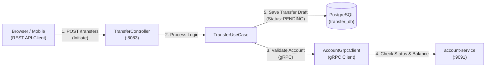
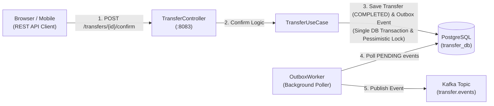
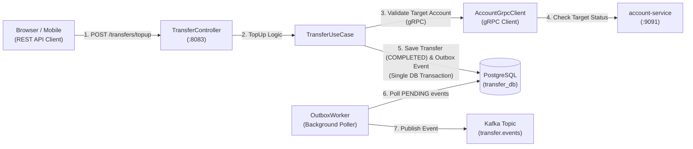

# Transfer Service

A mission-critical, banking-grade service responsible for managing fund transfers, implementing the **Transactional Outbox Pattern**, and ensuring idempotency and distributed consistency across the **Banking Services** platform.

It handles transfer initiation, validation (via gRPC), execution (using pessimistic locking), and asynchronous balance updates by publishing domain events to Kafka.

The service runs on port **`:8083`** and uses **PostgreSQL** as the immutable source of truth for all transaction records.

---

## Architecture

### 1. Initiate Transfer Flow (Draft)
Creates a draft transfer that requires confirmation before execution.



### 2. Confirm Transfer Flow (Outbox Pattern)
Executes the transfer via pessimistic locking and reliably updates account balances asynchronously through Kafka.



### 3. Top-Up Flow (External to Bank)
Validates the target account and directly completes the transaction while utilizing the Outbox pattern.



### Component Overview

| Component | Package | Responsibility |
|---|---|---|
| **TransferController** | `internal/delivery/http` | Exposes REST endpoints, validates HTTP requests, checks JWT & Idempotency Key, and routes requests to the UseCase. |
| **TransferUseCase** | `internal/usecase` | Implements core business logic. Uses concurrency (WaitGroups/ErrGroup) for parallel gRPC calls. Coordinates database transactions and implements the Outbox Pattern. |
| **TransferRepository** | `internal/repository` | Handles PostgreSQL database interactions using pessimistic locking (`SELECT ... FOR UPDATE`) to prevent concurrent modification issues during transfer confirmations. |
| **OutboxWorker** | `internal/worker` | Background polling worker that scans the `outbox_events` table for `PENDING` events and reliably publishes them to Kafka. Retries on failure. |
| **AccountGrpcClient** | `internal/gateway/grpc` | gRPC client connecting to `account-service` to rigorously validate account status and verify sufficient balances before locking funds. |
| **TransferEventPublisher** | `internal/gateway/messaging` | Kafka sync producer using Sarama. Partitions messages by `source_account_number` to guarantee ordered event delivery per account. |

---

## Core Financial Patterns

To achieve banking-grade consistency, the service utilizes several core patterns:

### 1. Transactional Outbox Pattern
Directly publishing to Kafka during a database transaction can lead to dual-write problems (DB commits but Kafka fails, or Kafka succeeds but DB rolls back). 
- We solve this by saving the business entity (`transfer`) and the event payload (`outbox_events`) in a **single ACID transaction**.
- The `OutboxWorker` polls `outbox_events` and publishes to Kafka. Only after Kafka acknowledges, the event is marked as `PUBLISHED`.

### 2. Idempotency Key
Every transfer initiation or top-up requires an `X-Idempotency-Key` header (usually generated by the client). This key is persisted as `reference_id` with a `UNIQUE INDEX` in the database to guarantee that network retries do not result in double-spending.

### 3. Pessimistic Locking
When a user confirms or cancels a transfer, the database row is locked using `FindByIdLocked` (`SELECT ... FOR UPDATE`). This prevents a race condition if the user taps "Confirm" simultaneously on two different devices.

### 4. Zero-Float Tolerance
Amounts are strictly handled using the `shopspring/decimal` package to avoid floating-point precision loss inherent in basic `float64` operations.

---

## Transfer Lifecycle (State Machine)

Transfers progress through a strict state machine:

| Status | Trigger | Description |
|---|---|---|
| `PENDING` | `InitiateTransfer` | Transfer drafted. Accounts validated but balances are not affected yet. Awaiting user confirmation. |
| `COMPLETED` | `ConfirmTransfer` / `TopUp` | User confirmed. Settled at timestamp recorded. Outbox event created for balance impact. |
| `FAILED` | `CancelTransfer` / System Error | User cancelled the pending transfer or a technical error occurred. |
| `REVERSED` | Future use | A completed transfer is reversed manually due to dispute or fraud. |

---

## Getting Started

### Prerequisites

- Go 1.25+
- Docker & Docker Compose
- Running PostgreSQL (default port `5434`)
- Running Kafka broker (default `localhost:9092`)
- Running `account-service` via gRPC (default `localhost:9091`)
- RSA public key for JWT verification at `secrets/public.pem`

### Run Locally

1. Prepare database and configurations:
   Ensure `transfer_db` is created in PostgreSQL and `account-service` is listening on gRPC.
2. Provide JWT public key:
   Place `public.pem` generated by the auth-service into `secrets/public.pem`.
3. Start the service:
   ```bash
   go run cmd/web/main.go
   ```

### Run with Docker

```bash
docker-compose up -d --build
```

---

## HTTP Endpoints

All endpoints are protected by JWT and include a Correlation ID middleware. Base path: `/api/v1`

### Transfer Operations

| Method | Endpoint | Description | Idempotency Key |
|---|---|---|:---:|
| `POST` | `/transfers/topup` | Top-up from external source to a bank account. Directly completes. | Required |
| `POST` | `/transfers` | Initiate an internal transfer (Drafts as `PENDING`) | Required |
| `POST` | `/transfers/:referenceId/confirm` | Confirm an initiated transfer (`PENDING` → `COMPLETED`) | N/A |
| `POST` | `/transfers/:referenceId/cancel` | Cancel an initiated transfer (`PENDING` → `FAILED`) | N/A |

### Queries & History

| Method | Endpoint | Description |
|---|---|---|
| `GET` | `/transfers/:referenceId` | Get detailed transfer receipt and status |
| `GET` | `/transfers` | Get paginated list of my transfers |
| `GET` | `/transfers/accounts/:accountNumber/history` | Get account statement / mutation history |

> **Header Requirements**: 
> - `Authorization: Bearer <your_token>`
> - `X-Correlation-ID: <random_uuid_or_string>` 
> - `X-Idempotency-Key: <unique_string>` (required for POST `/transfers` and `/transfers/topup`)

### Health and Monitoring

| Method | Endpoint | Description |
|---|---|---|
| `GET` | `/health` | Application status |
| `GET` | `/health/ready` | Database readiness check |

---

## Configuration

Configuration is loaded from `config.json` (development) or `config-prod.json` (production container):

```jsonc
{
  "app": { "name": "transfer-service" },
  "web": { "prefork": false, "port": 8083 },
  "jwt": { "public_key_path": "secrets/public.pem" },
  "grpc": { "server": "localhost:9091" },
  "telemetry": { "enabled": false, "endpoint": "localhost:4319" },
  "database": {
    "username": "transfer_user",
    "password": "korie123",
    "host": "localhost",
    "port": 5434,
    "name": "transfer_db",
    "pool": { "idle": 10, "max": 100, "lifetime": 300 }
  },
  "kafka": {
    "bootstrap": { "servers": "localhost:9092" },
    "producer": { "enabled": true, "topic": "transfer.events" }
  }
}
```

---

## Project Structure

```
transfer-service/
├── cmd/
│   └── web/
│       └── main.go                  # Application entry point
├── db/
│   └── migrations/                  # Up/Down SQL migration files
├── internal/
│   ├── config/                      # Bootstrap, DI wiring & viper loader
│   ├── delivery/
│   │   └── http/                    # Fiber Controllers, Middleware, Routes
│   ├── entity/                      # Core Domain Entities (Transfer, OutboxEvent)
│   ├── event/                       # Kafka Payload Defines
│   ├── gateway/
│   │   ├── grpc/                    # gRPC Clients (account-service)
│   │   └── messaging/               # Kafka Producers
│   ├── model/                       # Request/Response DTOs & Pagination
│   ├── repository/                  # GORM Database Operations
│   ├── shared/                      # Exceptions, API Response formats
│   ├── telemetry/                   # OpenTelemetry config
│   ├── usecase/                     # Core Business Logic
│   └── worker/                      # Outbox Poller daemon
├── secrets/                         # RSA Public Key folder
├── docker-compose.yaml              # Docker composition with PostgreSQL
├── Dockerfile                       # Multi-stage Docker build script
└── TEST.http                        # VS Code REST Client test definitions
```
